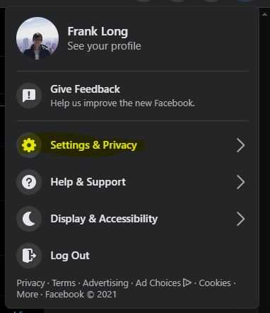
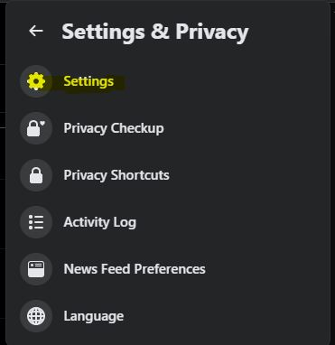
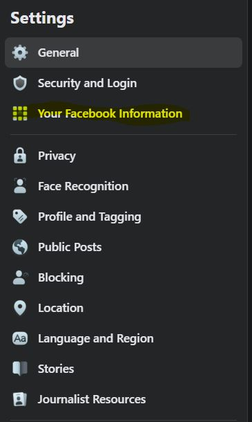
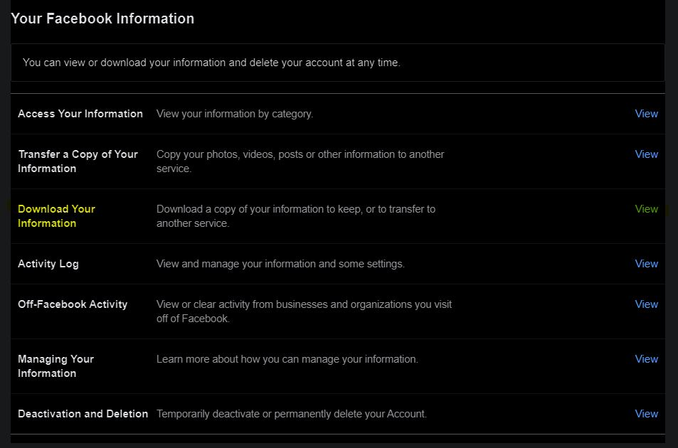
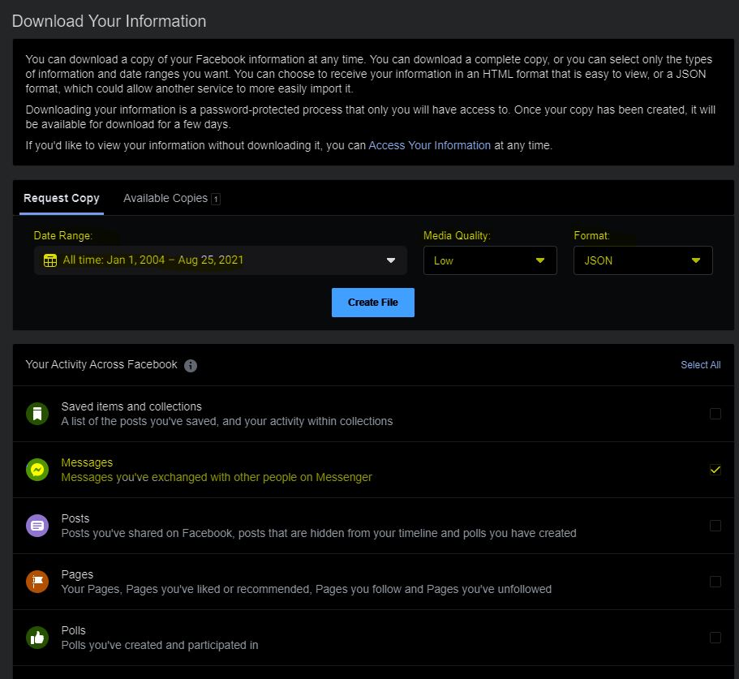
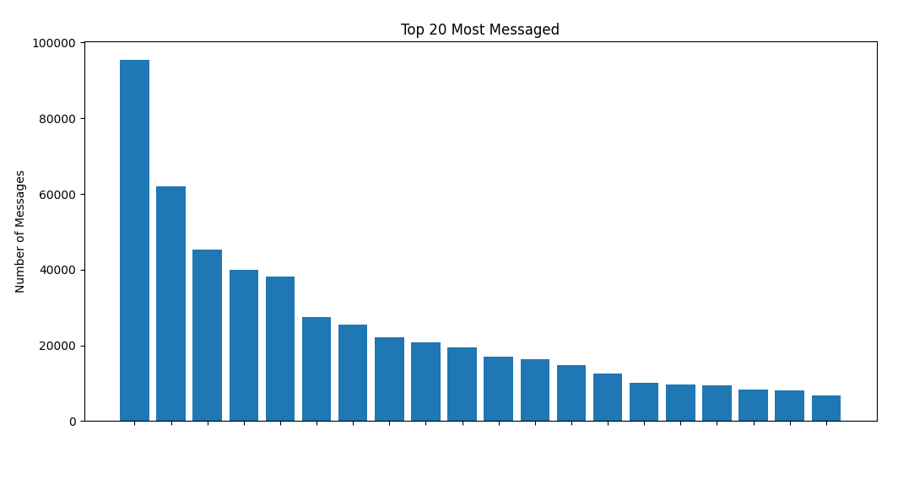
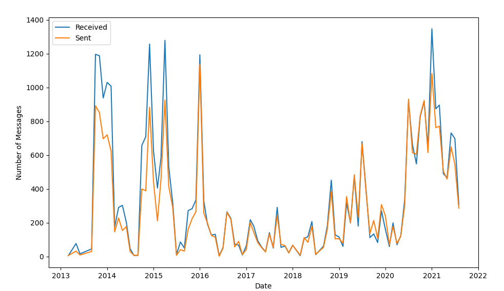

# Messenger-Analyzer
Parses JSON files that hold Facebook messenger data and allows user to generate graphs and trends. Download Facebook Messenger data in JSON format and edit rootpath to use

## Usage

Make sure to have Python 3 installed.

Pass the path to your Facebook messages/inbox directory of data as a command line argument.

```bash
python main.py "path/to/json/facebook/messages/inbox/"
```

## Required Libraries
* pandas
* matplotlib
* seaborn
* numpy
* spacy (with en_core_web_sm model)
* pymongo

## How to download Facebook Messages Data
1. After logging in to facebook.com, click the dropdown menu in the top right corner. Select "Settings & Privacy" --> "Settings"
<br>




2. On the left panel, select "Your Facebook Information". Then click on "View" by "Download Your Information"
<br>




3. Choose your date range, set the media quality to low (allows for fast download as we don't access the media files), and set the format to JSON. In the selection menu beneath, "Deselect All" then check off "Messages" 
<br>



4. After the download is ready, you will be notified. Download the zip file and extract it. The data is now ready to be fed to the program!

## Major functions
### load()
Connects to local MongoDB database and creates two collections:
* contacts - each document has a name and contact_id field
* messages - collection of all messages sent and received as per the provided JSON files. Additional fields for conversation identification and dates are added

### update()
Connects to local MongoDB and adds data to the existing collections. This is almost identical to load(). Kept separate for now in case of future changes. 

### getLastMessage()
Returns the date of the last message in the database. This allows you to know which date to start at when downloading data again to update the database. Note that since Facebook does not allow you to specify the hour, it is recommended to start on the next day. Unfortunately, you will miss any messages sent the previous day after the last download. This could be avoided by checking each message to see if it is already in the database, but that significantly slows down the import. 

### analyze()
Launches the tkinter GUI to allow the user to select various visualizations. Currently does not fully support the MongoDB structures. WIP

## Available Visualizations
Note that date filters will be added soon. Sample images of the visualizations to come as well!
### Top 10 (n) Most Messaged
Identifies who you have exchanged the most messages with ever! WARNING: Results may surprise you
<br>



### Messages over time (sent and received)
Shows activity over time. May be able to identify cyclical patterns or trends. Can also see the effect of certain effects on your messaging habits (e.g. Do I talk to more people during a global pandemic?)
<br>


### Messages over time with a specific contact (sent and received)
Similar to above. 
<br>


### Hourly Distribution of sent messages
Provides information on when you are most likely to reply. Can be used to identify unhealthy patterns or habits. 
<br>


### Word spectrum
For a specific contact, identify which words you are more likely to type opposed to your contact. 
<br>

